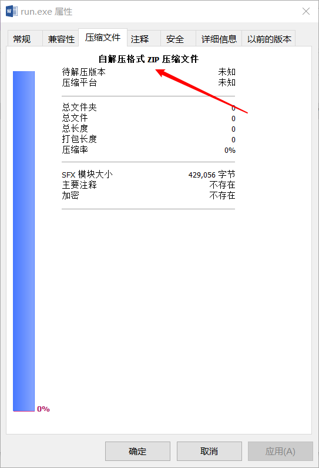
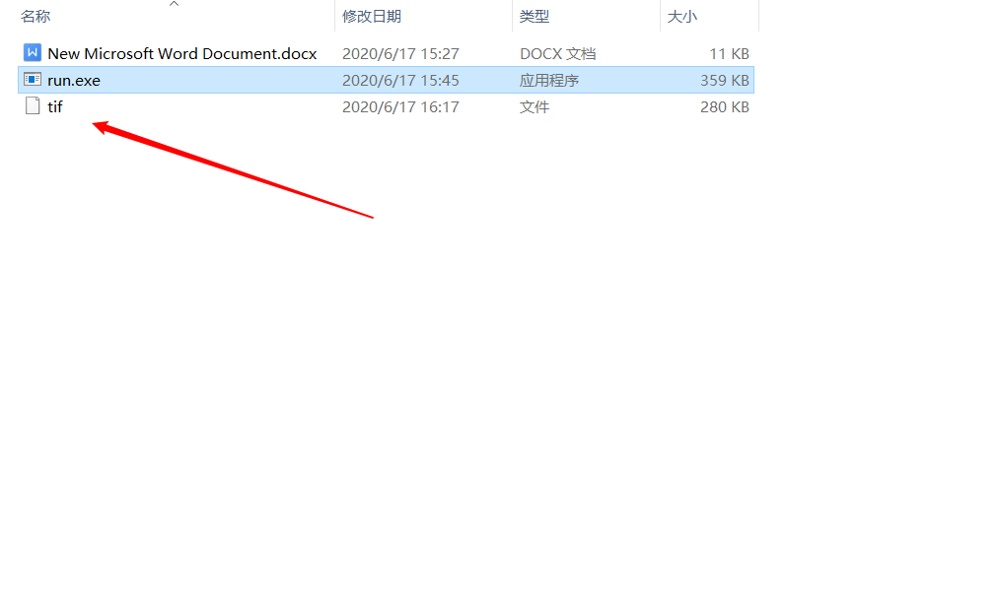
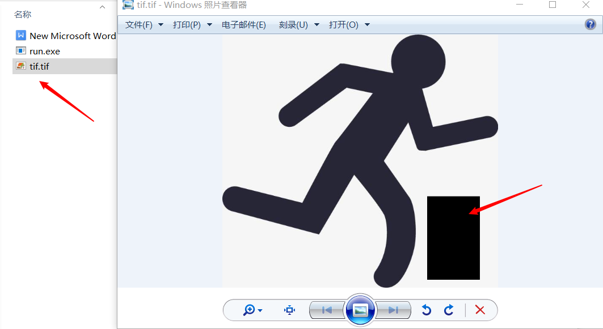
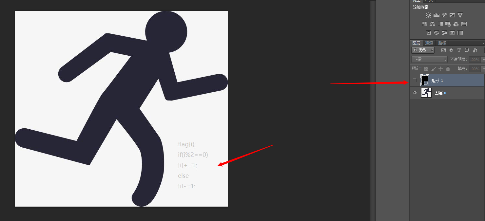
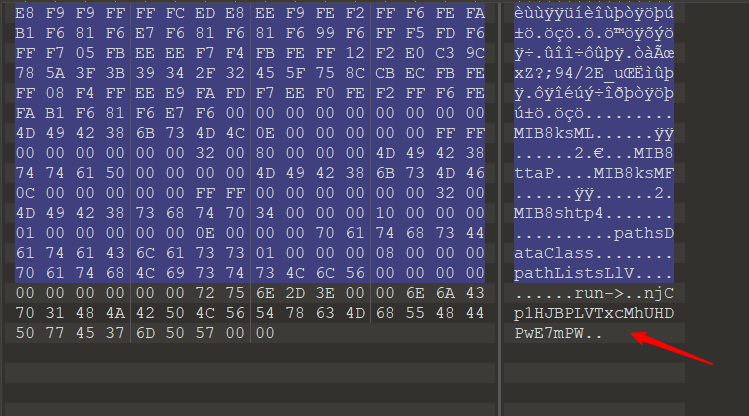

# run write up

+ 1、右键查看文件属性，是自解压文件


+ 2、解压得到两个文件，word里只有Error!!!。


+ 3、运行run.exe，得到一个tif文件。


+ 4、tif添加后缀名.tif，用图片查看器打开。可以正常打开，右下角有一块黑色区域。


+ 5、用Photoshop查看tif文件，可以看到黑色是一块图层。关闭图层显示，看到提示。
  
  

+ 6、用010Editor打开tif文件，可以发现字符串：
  

+ 7、根据提示，构建解密脚本：
```python3
# python3

bytearray=b"njCp1HJBPLVTxcMhUHDPwE7mPW"

flag="flag{"

for i in range(len(bytearray)):
    if i % 2==0:
        c=bytearray[i]
        c-=1
        flag+=chr(c)

    else:
        c=bytearray[i]
        c+=1
        flag+=chr(c)

flag+="}"
print (flag)
```
> flag{mkBq0IICOMUUwdLiTICQvF6nOX}